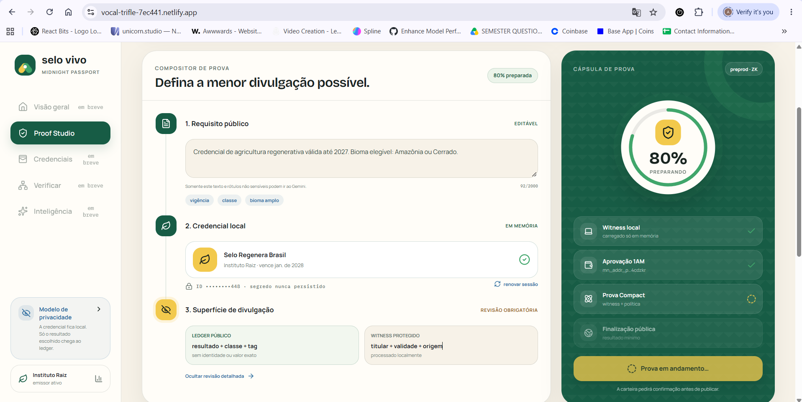
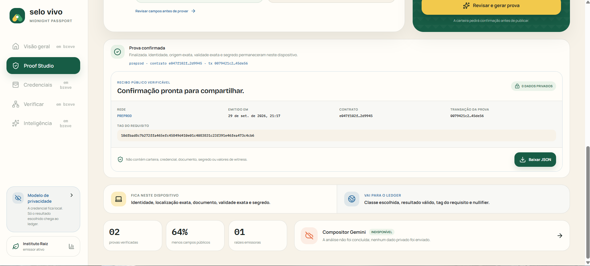
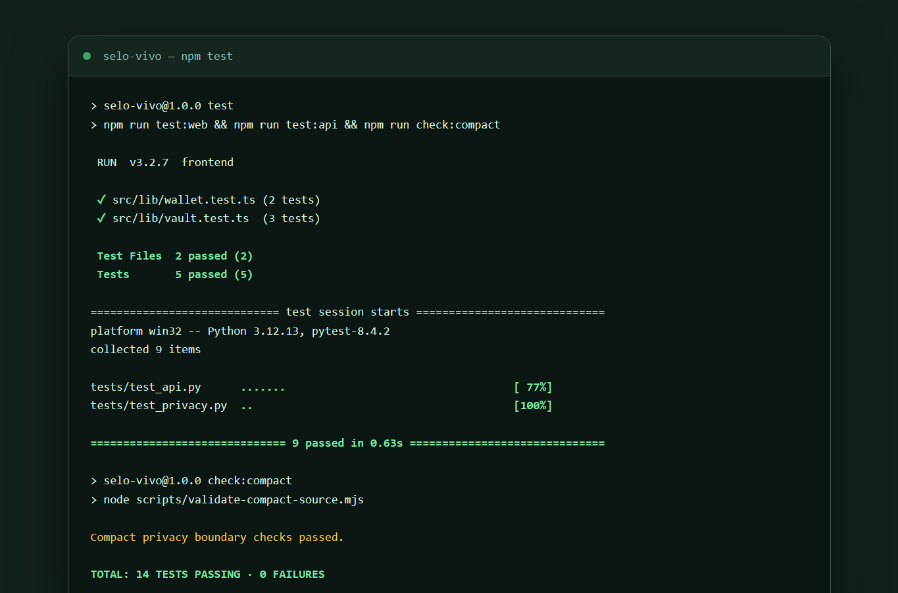

# Selo Vivo

[](https://github.com/sayanacharya22-byte/Selo-Vivo/actions/workflows/ci.yml)

**Hosting:** Netlify for the React application and Render for the FastAPI service. See the [deployment runbook](docs/DEPLOYMENT.md).

**A confidential sustainability passport for Brazilian producer cooperatives, powered by Midnight.**

Selo Vivo lets a cooperative prove that a trusted credential is valid, current, and relevant to a buyer's policy without publishing the cooperative identity, exact farm or workshop, audit documents, precise biome evidence, or production data. It is a new **Confidential Credentials** product—not an allowlist or identity-gating clone of VeilPass.

The interface uses a contemporary Brazilian visual language: warm paper, forest and leaf greens, clay, azulejo blue, sun yellow, modernist curves, and restrained tile rhythm. [Open the approved design study](https://superdesign.dev/teams/03513578-b489-47f4-94a9-6b52bd539f60/projects/3f620c05-b6c6-4b60-9dcb-4f6abd45d0a2?node=draft-variant-fdb48004-8584-4fd6-8912-64d8f6cf40ab).

## Website screenshots






## Why this product matters

Small producers are often asked to send far more data than a procurement decision requires. Selo Vivo turns a buyer's public policy into the smallest useful proof:

1. The buyer enters a public requirement.
2. Gemini proposes a minimal disclosure plan from that requirement and safe labels only.
3. The holder explicitly loads a credential into ephemeral, in-memory private state.
4. A Compact circuit checks issuer commitment, credential class, expiry, and broad biome group.
5. Midnight records a nullifier, selected class, request tag, and aggregate count—never the raw credential.

## Stack

| Layer | Technology | Responsibility |
|---|---|---|
| Privacy contract | Compact 0.31.1 / Midnight | ZK checks, nullifier, deliberate disclosure, public counters |
| Frontend | React 19, TypeScript, Vite, Framer Motion | 1AM connection, local vault, proof UX |
| AI | Gemini Interactions API via `google-genai` | Privacy-minimized proof-plan composition |
| API | FastAPI, SQLAlchemy async, Alembic | Public proof receipts, issuers, aggregate metrics |
| Database | Neon Postgres | Public metadata only; pooled app traffic and direct migrations |
| Delivery | GitHub Actions, Netlify, Render | Quality gate and Git-based deployments |

## Privacy model

| An observer can learn | An observer cannot learn |
|---|---|
| A proof finalized successfully | Holder identity or wallet address |
| The deliberately disclosed credential class | Exact farm/workshop or coordinates |
| A SHA-256 tag for the buyer's public requirement | Credential document or audit evidence |
| A request-scoped nullifier | Exact expiry date or biome evidence |
| Aggregate verified-proof count | Holder secret, witness values, revenue, or production volume |

`disclose()` appears only where public state genuinely needs a value: the derived nullifier, requested class, and public request tag. The private issuer commitment, credential class, exact expiry, broad biome witness, and holder secret enter through Compact witnesses and remain private. See [the full privacy model](docs/PRIVACY_MODEL.md).

## Run locally

Prerequisites: Node 22, Python 3.11–3.14, `uv`, Chrome, the 1AM wallet, Compact compiler 0.31.1, and Docker Desktop if using a local proof server. On Windows, use WSL for Compact.

```bash
cp .env.example .env
npm install
uv sync --directory backend
npm run contracts:compile
npm run db:migrate
npm run dev
```

The frontend opens at `http://localhost:5173`, FastAPI at `http://localhost:8000`, and API docs at `http://localhost:8000/docs`.

To run the pinned local proof server:

```bash
docker compose -f docker-compose.midnight.yml up
```

Then select `Local (http://localhost:6300)` in the wallet proving settings. The browser implementation can also delegate proving to the service already configured by 1AM.

### Environment

- `DATABASE_URL`: Neon pooled connection string for API traffic.
- `DATABASE_URL_UNPOOLED`: direct Neon connection string for Alembic.
- `GEMINI_API_KEY`: server-side only; never exposed to Vite.
- `GEMINI_MODEL`: defaults to `gemini-3.8-flash`.
- `VITE_API_URL`: public FastAPI origin.
- `CORS_ORIGINS`: exact comma-separated Netlify and custom frontend origins; wildcards are rejected in production.
- `ALLOWED_HOSTS`: optional comma-separated custom API domains. Render's generated hostname is trusted automatically.

The provisioned Neon project is `selo-vivo` in São Paulo (`aws-sa-east-1`), with production branch `br-divine-forest-acrrbkka` and isolated development branch `br-solitary-union-acshvy1v`. Secrets are intentionally not committed. API traffic uses the pooled URL; Alembic uses the direct URL.

## 1AM and Midnight flow

1. Install/enable 1AM in Chrome and fund Preview or Preprod DUST.
2. Choose the matching network in Selo Vivo and click **Conectar 1AM**.
3. Review or edit the public buyer requirement.
4. Optionally run **Compositor Gemini**; only public text and safe labels leave the browser.
5. Open the disclosure review, then click **Revisar e gerar prova**.
6. The connected wallet deploys its own constructor-bound contract on the selected network, invokes `prove_credential`, and displays both the contract address and finalized transaction ID. The deployment is reused only for that wallet and network during the current page session.

Changing network or disconnecting clears the in-memory wallet session. Demo credential material is never placed in localStorage or sessionStorage and disappears with the page session. Contract maintenance keys stay in ephemeral memory and cannot be exported by the app.

## Preprod

- Contract address: [`87c5a926a5a909183466414da4ef546918af51327ebae6f1ceb32c51f405c9c2`](https://explorer.1am.xyz/contract/87c5a926a5a909183466414da4ef546918af51327ebae6f1ceb32c51f405c9c2?network=preprod)
- Deployment transaction hash: [`2d8e8e41517decd500125f6fcbe33b6833e13bc1f68822f02b2300bad498db07`](https://explorer.1am.xyz/tx/2d8e8e41517decd500125f6fcbe33b6833e13bc1f68822f02b2300bad498db07?network=preprod)

## Contract

[`contract/src/selo-vivo.compact`](contract/src/selo-vivo.compact) defines:

- public ledger cells: constructor-bound issuer root, verified-proof counter, used nullifiers, last disclosed class, and last request tag;
- private witnesses: issuer commitment, credential class, exact expiry epoch, broad biome group, and holder secret;
- `constructor(root)`: binds the disclosed trust root atomically during deployment, eliminating a first-writer registration window;
- `prove_credential`: validates all private claims, blocks request-scoped reuse, and publishes only deliberate disclosures.

Compiled JavaScript bindings, ZKIR, prover keys, and verifier keys are committed under `contract/managed`, `frontend/generated`, and `frontend/public`. This is intentional because production frontend builders do not ship the Compact compiler.

## Tests and CI

```bash
npm test       # 22 tests + Compact privacy validator
npm run lint   # ESLint + Ruff
npm run build  # TypeScript + Vite production bundle
```

The workflow at [`.github/workflows/ci.yml`](.github/workflows/ci.yml) installs Node 22, Python dependencies, and Compact 0.31.1; audits production packages; recompiles the contract; checks generated artifacts; runs lint and all tests; builds the frontend; and builds the non-root API container. Netlify builds from `main`; Render is configured to deploy only after the GitHub checks pass. A second workflow runs CodeQL for TypeScript and Python, and Dependabot tracks npm, uv, and Actions updates.



## Deployment

- Frontend: import the repository into Netlify. [`netlify.toml`](netlify.toml) pins Node, builds the npm workspace, publishes `frontend/dist`, supports SPA navigation, and applies security and cache headers.
- API: create a Render Blueprint from [`render.yaml`](render.yaml), then add the Neon, Gemini, and exact Netlify-origin settings. The free-tier-safe start command applies Alembic migrations before Uvicorn starts; Render checks `/health`, while `/ready` verifies database reachability.
- Container: [`backend/Dockerfile`](backend/Dockerfile) builds a pinned, non-root FastAPI image with a health check.
- Database: run `npm run db:migrate` with the direct Neon URL. Apply migrations to a development branch before production.
- Midnight: each connected 1AM wallet deploys its own constructor-bound contract on the selected Preview or Preprod network when it submits its first proof. No shared contract-address environment variable is required.

Use the exact environment-variable checklist and post-deploy smoke tests in [docs/DEPLOYMENT.md](docs/DEPLOYMENT.md). Never place `GEMINI_API_KEY` or a Neon connection string in Netlify—the browser bundle can expose every `VITE_*` value.

## Repository map

```text
backend/                 FastAPI, SQLAlchemy, Alembic, tests
contract/                Compact source and generated circuits
frontend/                React proof studio and Midnight.js integration
docs/                    proposal, privacy analysis, demo script
scripts/                 compiler, artifact sync, source-policy checks
.github/workflows/       CI/CD quality gate
```

## Submission assets

- Approved category: **Confidential Credentials**
- Product proposal: [`docs/PRODUCT_PROPOSAL.md`](docs/PRODUCT_PROPOSAL.md)
- Privacy model: [`docs/PRIVACY_MODEL.md`](docs/PRIVACY_MODEL.md)
- One-minute demo script: [`docs/DEMO_SCRIPT.md`](docs/DEMO_SCRIPT.md)
- CI workflow: [`.github/workflows/ci.yml`](.github/workflows/ci.yml)
- Test command: `npm test` (19 passing)
- Meaningful commits: 10+ in local history

## License

Apache-2.0. The repository is production-oriented, but Preview and Preprod still carry test assets. Mainnet use requires an independent circuit/security audit, governed issuer-root rotation, operational monitoring, and real credential issuance controls.
